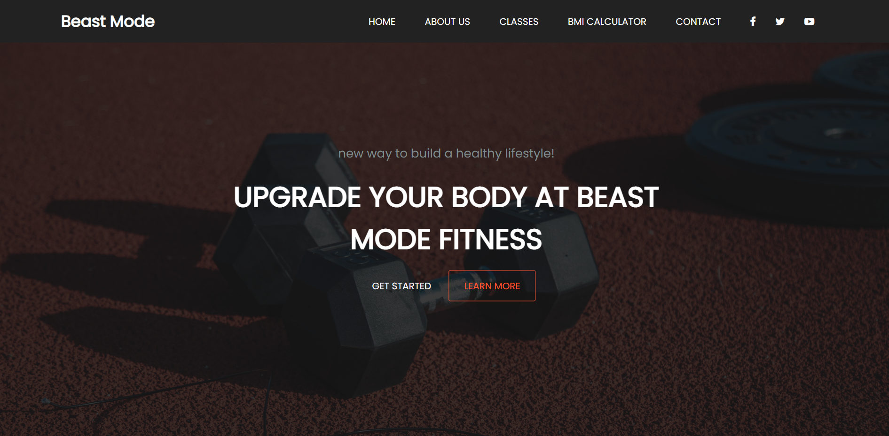
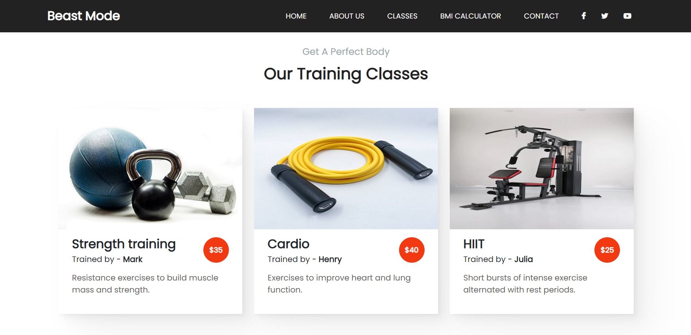
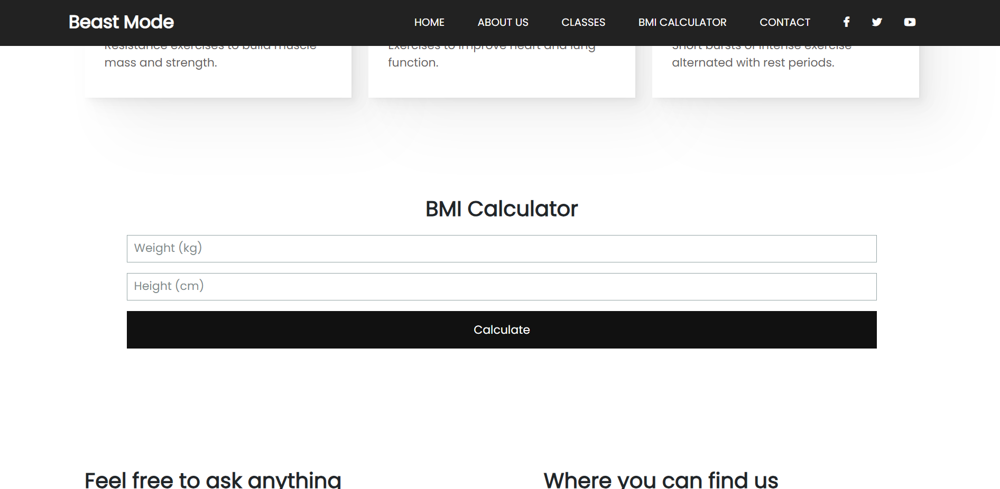
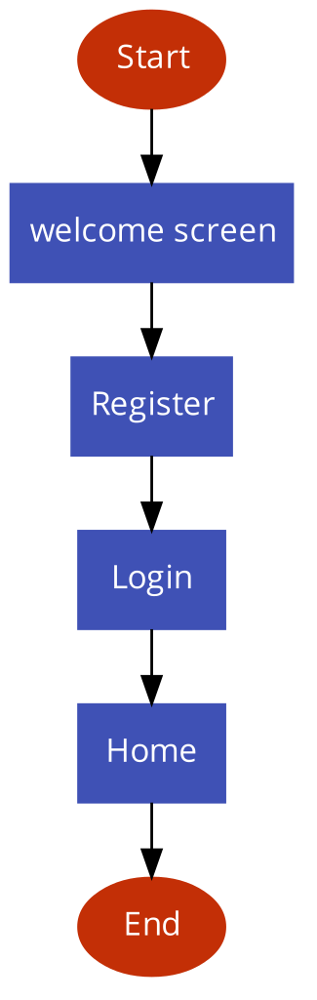

# Beast Mode Fitness Website

## Overview

The Beast Mode Fitness website is designed to provide users with a new way to build a healthy lifestyle. It offers various features such as information about the fitness center, classes, a BMI calculator, and contact details. The goal of the project is to create an engaging and informative website for users interested in fitness.

## Team
- Halah Abdulmajeed Alzuaki 441017909
- Bayan Abdullah Almuhanna 441017906
- Sarh Saad Alzhrani 443021851

Section: 372 
Instructor:Basma alsoli

### Screenshots

Include screenshots of the different sections of the website to provide an overview of its design and layout.

- Home Page
  

- Classes Page
  

- BMI Calculator
  

## Technologies Used

- HTML
- CSS
- JavaScript
- Node.js
- Express
- MongoDB

## User Interaction Flow

The user journey on the website can be summarized using the following flowchart:

## Getting Started

To run the project locally, follow these steps:

1. Clone the repository: `git clone https://github.com/your-username/beast-mode-fitness.git`
2. Install dependencies: `npm install`
3. Start MongoDB: `mongod`
4. Start the server: `node app.js`
5. Open the website in your browser: `http://localhost:3000`
# Beast Mode Fitness Website

## Overview

The Beast Mode Fitness website is designed to provide users with a new way to build a healthy lifestyle. It offers various features such as information about the fitness center, classes, a BMI calculator, and contact details. The goal of the project is to create an engaging and informative website for users interested in fitness.

## Team
- Halah Abdulmajeed Alzuaki 441017909
- Bayan Abdullah Almuhanna 441017906
- Sarh Saad Alzhrani 443021851

Section: 372 
Instructor:Basma alsoli

### Screenshots

Include screenshots of the different sections of the website to provide an overview of its design and layout.

- Home Page
  

- Classes Page
  

- BMI Calculator
  

## Technologies Used

- HTML
- CSS
- JavaScript
- Node.js
- Express
- MongoDB

## User Interaction Flow

The user journey on the website can be summarized using the following flowchart:

## Getting Started

To run the project locally, follow these steps:

1. Clone the repository: `git clone https://github.com/your-username/beast-mode-fitness.git`
2. Install dependencies: `npm install`
3. Start MongoDB: `mongod`
4. Start the server: `node app.js`
5. Open the website in your browser: `http://localhost:3000`
